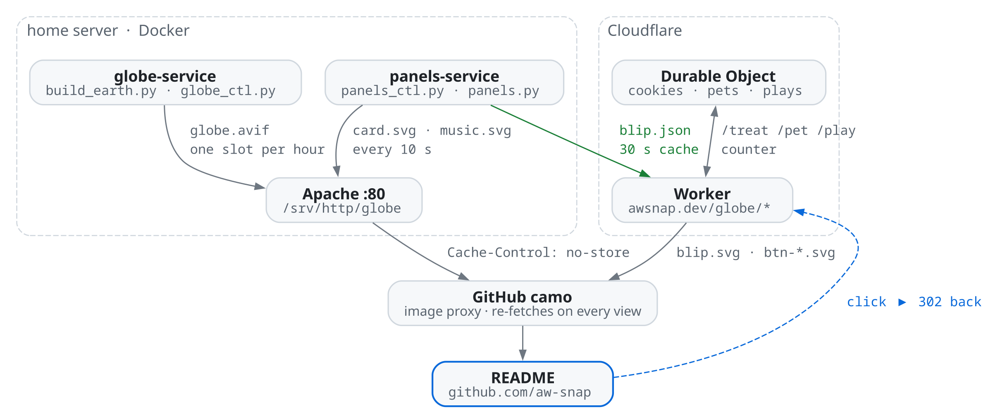

# live-readme

The code behind [github.com/aw-snap](https://github.com/aw-snap): a GitHub profile rendered live by my home server and a Cloudflare Worker.

This is the profile live, straight from the servers. Every image is fetched fresh each reload, and buttons work (they redirect you to the profile afterwards).

<br/>

<p align="center">
  
</p>

<p align="center">
  
</p>

<p align="center">
  
</p>

<p align="center">
  <a href="https://awsnap.dev/globe/pet"></a>
  <br/>
  <a href="https://awsnap.dev/globe/treat"></a> <a href="https://awsnap.dev/globe/pet"></a> <a href="https://awsnap.dev/globe/play"></a>
</p>

<br/>

| panel | what it shows | rendered by |
|---|---|---|
| globe | Earth lit for the real time of day as an animated AVIF | `globe/`, one pre-rendered slot per hour |
| fastfetch | time, server uptime, languages, hobbies and contact | `panels/`, every 10 s |
| now-playing | the current or last music track with its album art | `panels/`, every 10 s |
| Blip | a cat that levels up from visitor interactions | `worker/` on Cloudflare, per request |

## How it works

<picture>
  <source media="(prefers-color-scheme: dark)" srcset="docs/architecture-dark.png">
  
</picture>

GitHub proxies every README image through camo (GitHubs image proxy) and forbids scripts, so we have to work with the following:

1. **camo honours `Cache-Control: no-store`.** The card, the music panel and Blip use it, so camo fetches the origin again on every page view. The globe is ~800 KB and is cached for five minutes instead.
2. **An SVG inside `` can't run JavaScript or load anything external, but SMIL animation works.** So everything is inlined. Text uses the viewer's monospace font, album art is a data URI, icons are paths, and every animation is declarative.

### The globe

`build_earth.py` is a numpy renderer: gamma-correct Lambert shading, additive city lights, a soft twilight terminator, lit clouds, GGX sun glint, an atmosphere rim and a marker on New Zealand. The light direction is the real lighting for a chosen UTC hour. Frames are supersampled, motion-blurred and encoded as an animated AVIF in the same window chrome as the SVG panels. A full render takes about half an hour staggered on the server, so instead it renders on demand.

`globe_ctl.py` keeps a set of saved hour slots rendered: hourly cache around NZ dawn and dusk, where the lighting changes fastest, and every two hours otherwise. Every tick it copies the nearest slot to `globe.avif`, and every few hours it re-renders the stalest one. The three textures are included, with their sources and licences in [globe/TEXTURES.md](globe/TEXTURES.md).

### The card and the music panel

`panels_ctl.py` runs every 10 s. It reads `languages.json` for everything on the card except the time and uptime, the host's `/proc/uptime`, Last.fm's recent tracks, and Last.fm's top artist of the week for Blip's "favourite" line. When Last.fm has no cover for a track it asks Deezer then iTunes, and caches the result. It writes `card.svg`, `music.svg` and `blip.json` atomically.

`panels.py` builds the SVGs with the standard library only. Two details matter for text that must line up in whatever font the viewer has:

- the dotted leaders between labels and values are SVG lines, not runs of dots, so both ends stay anchored and only the leader flexes;
- the Arch logo is drawn as line segments on a grid, because ASCII slashes never join up across fonts.

NZ time and the sun's elevation are computed by hand, DST rule included, so the container needs no tzdata.

### Blip

The Worker serves `blip.svg` and the three button images, and handles `/treat`, `/pet` and `/play` by incrementing a Durable Object and redirecting back to the profile. A Durable Object rather than KV because KV is eventually consistent, and camo reads from a different edge than the one the clicker hit.

- **Only real clicks count.** Prefetches, link previews and bots are dropped by `Sec-Fetch-User`, `Sec-Fetch-Mode` and a user-agent blocklist.
- **Reactions are one-shot and private to the clicker.** A click stores a pending flag. The next render of the panel and of the clicked button, within 60 s, consumes it. The clicker's browser reloads the profile after the redirect and is the one that sees the cookie by Blip's mouth and the "+1" badge, which fades after five seconds with `fill="freeze"`. A refresh shows nothing special.
- **Levels.** XP is cookies + pets + plays. Each level costs `5 + level` XP, so level 2 at 8, level 10 at 100, level 40 at 1000. A bow at 5, a crown at 10, sparkles at 20.
- **Wants.** Blip wants whichever interaction it has had least recently, and that button pulses.
- **Streak** counts consecutive NZ days with at least one visitor. Blip is sleepy at night, using the sun elevation in `blip.json`.

The counter has never been reset and never will be: the Durable Object instance name and its migration are fixed.

### Things that were a little bit of a pain in the a##

- Two SVG documents in the same page share nothing. A star that flies out of one panel and into the next has to be drawn in both, and each image starts its animation clock when it is first painted, so the join is only as good as the load-time skew. That experiment is still in the code behind `"stars": true` in `languages.json`, off by default.
- `Header set Cache-Control no-store` has to be in the web root's `.htaccess` for exactly the live files. Cache the AVIF or camo will pull 800 KB per view.
- Fonts: assume nothing. Every viewer, GitHub's dark and light themes, and camo's own rendering of the "view image" page differ. Design in cells of `0.6em` and anchor both ends of every row.
- Test clicks count. `curl` with the right headers is a real click as far as the Worker knows, and the tally is permanent.

## Run your own

You need a Linux box with Docker and a web server reachable on port 80, a Cloudflare zone for the Worker, a Last.fm API key (optional for live music), and a GitHub profile repo.

```bash
# home server
docker build -t globe-deps globe/                     # python:3.13-slim + numpy + pillow
docker run -d --name globe-service --restart unless-stopped --user 1000:1000 \
  -e REGEN_HOURS=3 -v "$PWD/globe:/app" -v /srv/http/globe:/web globe-deps python /app/globe_ctl.py loop
cp panels/lastfm.example.json panels/lastfm.json      # then fill it in
docker run -d --name panels-service --restart unless-stopped --user 1000:1000 \
  -e WEB=/web -e GH_USER=you -e LOOP=10 -v "$PWD/panels:/app" -v /srv/http/globe:/web globe-deps python /app/panels_ctl.py loop
cp webroot/.htaccess /srv/http/globe/                 # Apache: AllowOverride FileInfo on that directory

# Cloudflare Worker
cd worker && npm install
# edit wrangler.toml (routes on your zone) and PROFILE / BLIP_STATE at the top of src/index.js
npx wrangler deploy
```

Then point your profile README at the images. [profile/README.md](profile/README.md) is the one in use. Edit `panels/languages.json` for the card's content; it is re-read every tick, no restart needed.

## History

| version | Blip |
|---|---|
| v1 | a pet that levelled up with my commit count |
| v2 | a cookie jar visitors could fill |
| v3 | the cat, with a commit heartbeat and a single cookie button |
| v4 | commits gone; levels come only from visitors' cookies, pets and plays |

## Licence

MIT for the code. The day and night maps are NASA imagery (public domain); the cloud map is Solar System Scope's, CC BY 4.0. See `globe/TEXTURES.md`.
